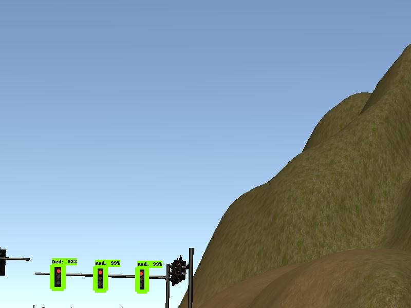
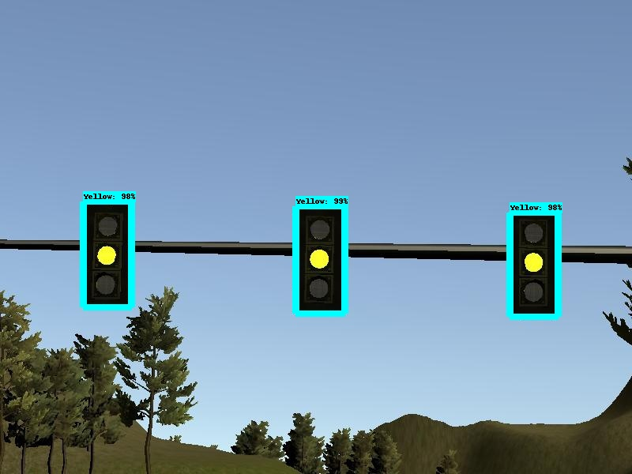
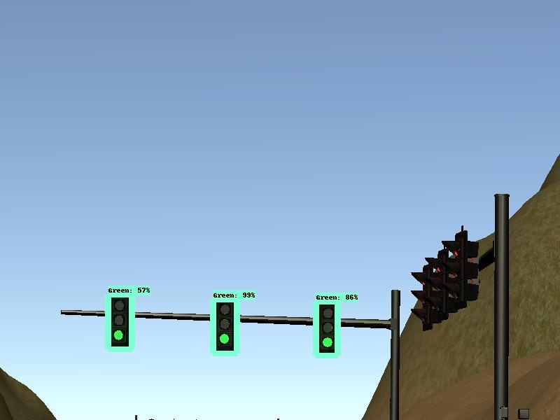

## Self-Driving Car Software Architecture
Note: For this project, the obstacle detection node is not implemented


## Perception Subsystem
This subsystem processes data from sensors and cameras into structured information that can eventually be used for path planning or control. In this project, we'll implement the traffic light detection node.

### Traffic Lighe Detection Node
This node subscribed to four topics:
1. /base_waypoints : The complete list of waypoints for the course.
2. /current_pose : The vehicle's location.
3. /image_color : Images from the vehicle's camera.
4. /vehicle/traffic_lights : The coordinates of all traffic lights.

And the node will publish the index of the waypoint for nearest upcoming red light's stop line to the /traffic_waypoint topic. Then the Waypoint Updater Node uses this information to determine if the car should slow down to safely stop at upcoming red lights.

For the traffic light detection I've used the COCO-trained models from [TensorFlow Object Detection API](https://github.com/tensorflow/models/blob/master/research/object_detection/g3doc/detection_model_zoo.md). The COCO-Trained models was pre-trained on [COCO dataset](http://cocodataset.org/#home) that contains 90 classes of images and the index for traffic light is 10. Since the COCO dataset include the traffic light detection, I used a lightweight pre-trained model : ssd_mobilenet_v1_coco that is based on Single Shot Multibox Detection (SSD), the running speed was fast and the detection accuracy was pretty good in the simulator, which is suitable for this project.

To train a model based on ssd_mobilenet_v1_coco, I collected total of 1056 images from the simulator, and used 856 images as training dataset, 200 images as test dataset, then utilized [LabelImg](https://github.com/tzutalin/labelImg) to manually label all the images. After labelling all the images, LabelImg will create xml file for each image, and we need to convert those xml files to two tfrecord files, one is the training data, the other is the test data. The COCO pre-trained model uses 90 classes of images, but in this project we only care about red light, yellow light, and green light, so we create a label map that only contains 3 classes(Red, Yellow, and Green). Finally, modified some variables in the config file of ssd_mobilenet_v1_coco model and trained the model for 20000 steps.

Here are some output images:








---
This is the project repo for the final project of the Udacity Self-Driving Car Nanodegree: Programming a Real Self-Driving Car. For more information about the project, see the project introduction [here](https://classroom.udacity.com/nanodegrees/nd013/parts/6047fe34-d93c-4f50-8336-b70ef10cb4b2/modules/e1a23b06-329a-4684-a717-ad476f0d8dff/lessons/462c933d-9f24-42d3-8bdc-a08a5fc866e4/concepts/5ab4b122-83e6-436d-850f-9f4d26627fd9).

Please use **one** of the two installation options, either native **or** docker installation.

### Native Installation

* Be sure that your workstation is running Ubuntu 16.04 Xenial Xerus or Ubuntu 14.04 Trusty Tahir. [Ubuntu downloads can be found here](https://www.ubuntu.com/download/desktop).
* If using a Virtual Machine to install Ubuntu, use the following configuration as minimum:
  * 2 CPU
  * 2 GB system memory
  * 25 GB of free hard drive space

  The Udacity provided virtual machine has ROS and Dataspeed DBW already installed, so you can skip the next two steps if you are using this.

* Follow these instructions to install ROS
  * [ROS Kinetic](http://wiki.ros.org/kinetic/Installation/Ubuntu) if you have Ubuntu 16.04.
  * [ROS Indigo](http://wiki.ros.org/indigo/Installation/Ubuntu) if you have Ubuntu 14.04.
* [Dataspeed DBW](https://bitbucket.org/DataspeedInc/dbw_mkz_ros)
  * Use this option to install the SDK on a workstation that already has ROS installed: [One Line SDK Install (binary)](https://bitbucket.org/DataspeedInc/dbw_mkz_ros/src/81e63fcc335d7b64139d7482017d6a97b405e250/ROS_SETUP.md?fileviewer=file-view-default)
* Download the [Udacity Simulator](https://github.com/udacity/CarND-Capstone/releases).

### Docker Installation
[Install Docker](https://docs.docker.com/engine/installation/)

Build the docker container
```bash
docker build . -t capstone
```

Run the docker file
```bash
docker run -p 4567:4567 -v $PWD:/capstone -v /tmp/log:/root/.ros/ --rm -it capstone
```

### Port Forwarding
To set up port forwarding, please refer to the "uWebSocketIO Starter Guide" found in the classroom (see Extended Kalman Filter Project lesson).

### Usage

1. Clone the project repository
```bash
git clone https://github.com/udacity/CarND-Capstone.git
```

2. Install python dependencies
```bash
cd CarND-Capstone
pip install -r requirements.txt
```
3. Make and run styx
```bash
cd ros
catkin_make
source devel/setup.sh
roslaunch launch/styx.launch
```
4. Run the simulator

### Real world testing
1. Download [training bag](https://s3-us-west-1.amazonaws.com/udacity-selfdrivingcar/traffic_light_bag_file.zip) that was recorded on the Udacity self-driving car.
2. Unzip the file
```bash
unzip traffic_light_bag_file.zip
```
3. Play the bag file
```bash
rosbag play -l traffic_light_bag_file/traffic_light_training.bag
```
4. Launch your project in site mode
```bash
cd CarND-Capstone/ros
roslaunch launch/site.launch
```
5. Confirm that traffic light detection works on real life images

### Other library/driver information
Outside of `requirements.txt`, here is information on other driver/library versions used in the simulator and Carla:

Specific to these libraries, the simulator grader and Carla use the following:

|        | Simulator | Carla  |
| :-----------: |:-------------:| :-----:|
| Nvidia driver | 384.130 | 384.130 |
| CUDA | 8.0.61 | 8.0.61 |
| cuDNN | 6.0.21 | 6.0.21 |
| TensorRT | N/A | N/A |
| OpenCV | 3.2.0-dev | 2.4.8 |
| OpenMP | N/A | N/A |

We are working on a fix to line up the OpenCV versions between the two.
